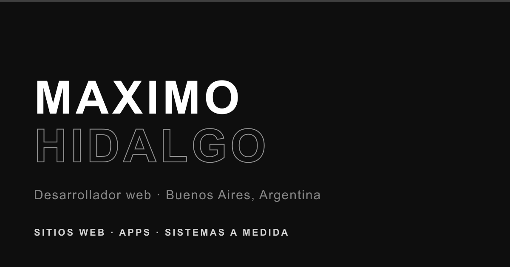
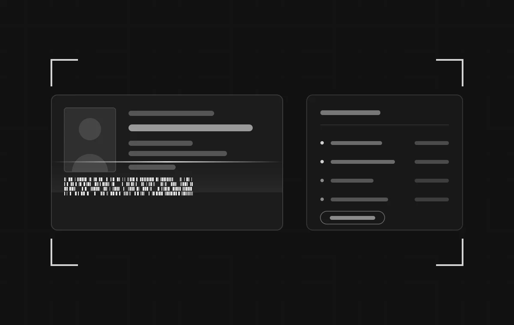
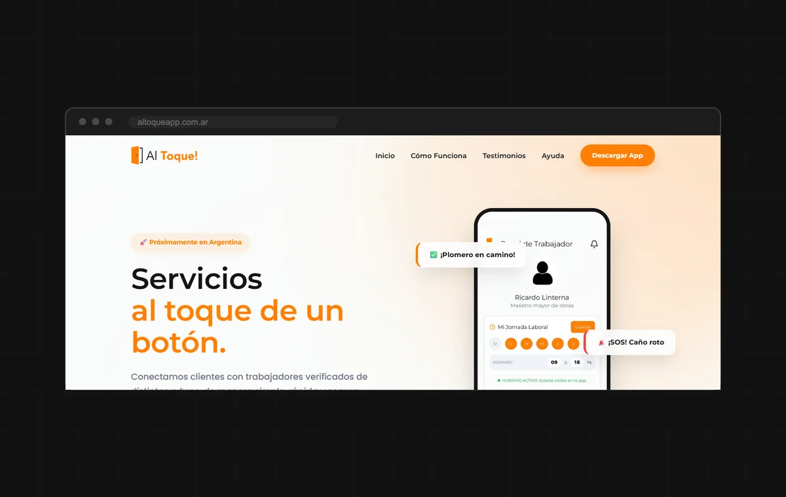
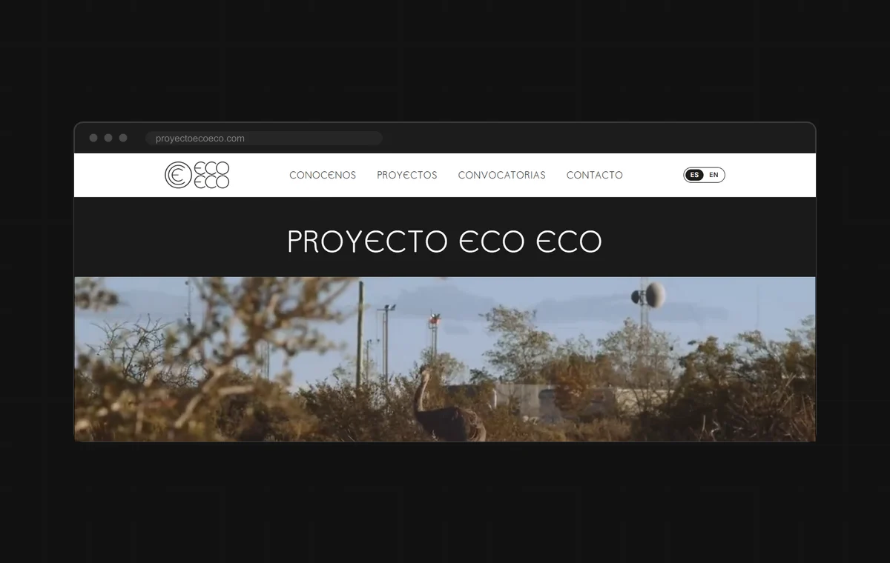
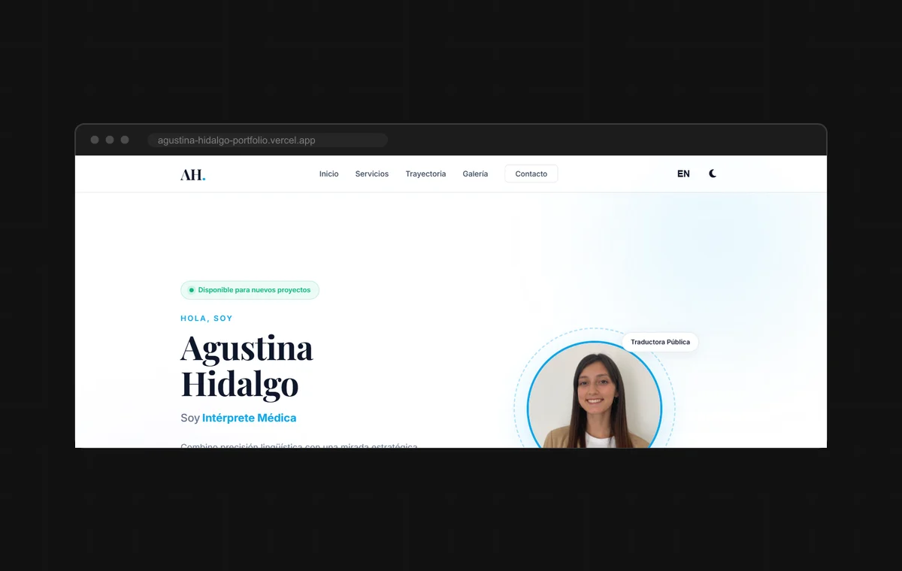

  

<h1 align="center">Maximo Hidalgo</h1>

<strong>Desarrollador web</strong> · Hago sitios web, apps y sistemas a medida para negocios

  
  
  
  

---

## Sobre mí

Trabajo como **Analista de Éxito del Cliente en Grupo Cormos**, una empresa de software de
salud, donde negocio con clientes y analizo casos todos los días. En paralelo desarrollo sitios web, apps y sistemas a medida como freelance.

Lo que más me gusta es encarar un proyecto entero: **sentarme con el cliente, entender qué
necesita, proponer una solución y programarla.** Así hice el sistema de control de acceso
para la Asociación del Fútbol Argentino, solo y de punta a punta.

**Ahora mismo:** Analista de Sistemas en la Escuela Da Vinci

---

## Proyectos destacados

<table>
<tr>
<td width="50%" valign="top">

### <a href="https://github.com/MaximoH04/DNIScannerAPP">Control de acceso por DNI</a>

Sistema para registrar visitantes en las oficinas de la **AFA** escaneando el código PDF417
del DNI. Me reuní con el equipo, hice el análisis, presenté la propuesta y lo programé
completo.

`Python` `OpenCV` `Tkinter` `Excel`
<a href="https://portfolio-maximo-hidalgo.vercel.app/caso-control-acceso-dni.html">Ver caso</a>

</td>
<td width="50%" valign="top">

### <a href="https://altoqueapp.com.ar">Al Toque!</a>

App que conecta clientes con trabajadores verificados: chat, modo SOS para urgencias y
calificaciones. **El proyecto está en pausa**, pero en su web se ve cómo quedó.

`React Native` `Expo` `Mobile`
<a href="https://portfolio-maximo-hidalgo.vercel.app/caso-al-toque.html">Ver caso</a>

</td>
</tr>
<tr>
<td width="50%" valign="top">

### <a href="https://www.proyectoecoeco.com">Proyecto ECO ECO</a>

Sitio bilingüe para un proyecto artístico sobre el impacto de los hidrocarburos en los
territorios, con video de fondo, convocatorias y carrusel de producciones.

`HTML` `CSS` `JavaScript`
<a href="https://www.proyectoecoeco.com">Ver en vivo</a>

</td>
<td width="50%" valign="top">

### <a href="https://agustina-hidalgo-portfolio.vercel.app">Agustina Hidalgo</a>

Portfolio bilingüe para una traductora pública e intérprete médica, con selector de idioma,
modo oscuro y secciones de servicios y trayectoria.

`HTML` `CSS` `JavaScript`
<a href="https://agustina-hidalgo-portfolio.vercel.app">Ver en vivo</a>

</td>
</tr>
</table>

<a href="https://portfolio-maximo-hidalgo.vercel.app/proyectos.html">Ver todos los proyectos en mi portfolio</a>

---

## Con qué trabajo

**Código**

**Diseño y marketing**

---

## Más allá del código

También hago música: soy **cantante, guitarrista y compositor**. Estoy armando **PIEZAS**,
un disco conceptual de trap melódico, y el primer tema, **Sin Rumbo**, ya está en Spotify,
Apple Music y YouTube Music.

Además doy servicio técnico: reparación de computadoras e instalación de software.

---

  <a href="https://portfolio-maximo-hidalgo.vercel.app">portfolio-maximo-hidalgo.vercel.app</a>

